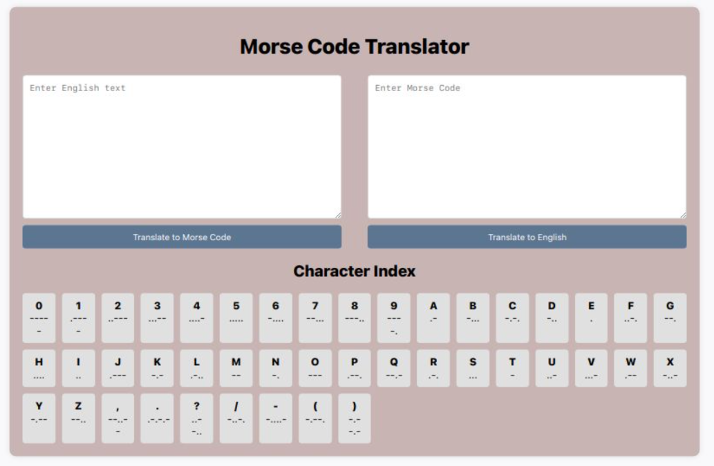

# Morse Code Translator Project

Welcome to the Morse Code Translator project! This project is a web application that allows users to translate between English text and Morse code in real-time. The application is designed to be intuitive and user-friendly, with a clean and responsive interface.


## Table of Contents
- [Introduction](#introduction)
- [Features](#features)
- [Installation](#installation)
- [Usage](#usage)
- [Development](#development)
- [Technologies Used](#technologies-used)
- [Testing](#testing)


## Introduction

The Morse Code Translator project is designed to bridge the gap between traditional communication methods and modern technology. By providing a tool that translates English text into Morse code and vice versa, this project aims to serve as both an educational resource and a practical application. Whether you're learning Morse code for the first time or need a quick translation tool, this application offers a seamless experience.

## Features

- **Button-Triggered Translation**: Translate text with the click of a button.
- **Two-Way Translation**: Supports translation from English to Morse code and vice versa.
- **Error Handling**: Displays appropriate error messages for invalid input.
- **Responsive Design**: Ensures usability on various screen sizes.


## Installation

To install and run this project locally, follow these steps:

1. **Clone the Repository**:
    ```sh
    git clone https://github.com/your-username/morse-code-translator.git
    cd morse-code-translator
    ```

2. **Install Dependencies**:
    ```sh
    npm install
    ```

3. **Compile SCSS to CSS**:
    ```sh
    sass --watch styles/main.scss styles/main.css
    ```

4. **Run the Project**:
    Open `index.html` in your browser.

## Usage

After setting up the project, open your web browser and navigate to `index.html` to use the Morse Code Translator interface.

### Text Translation

- **English to Morse Code**: Enter English text in the left textarea and click "Translate to Morse Code" to see the Morse code in the right textarea.
- **Morse Code to English**: Enter Morse code in the right textarea and click "Translate to English" to see the English text in the left textarea.

### Error Handling

- If the input is invalid (e.g., entering Morse code in the English text box), an error message will be displayed below the textareas.

## Development

### Initial Challenges and Solutions

1. **Incorrect Layout**:
   - **Problem**: The initial layout was not responsive and did not fit well on different screen sizes.
   - **Solution**: Used Flexbox for layout and added media queries for responsiveness.

2. **Validation Issues**:
   - **Problem**: No validation for input fields, leading to errors with invalid input.
   - **Solution**: Implemented validation functions to check for valid English and Morse code inputs.

3. **Error Handling**:
   - **Problem**: No error handling for invalid inputs, causing the application to not respond.
   - **Solution**: Added error handling to display appropriate error messages to users.

4. **SCSS Compilation**:
   - **Problem**: Initially not using SCSS, making styling less flexible.
   - **Solution**: Converted CSS to SCSS and used variables and nested rules for better maintainability.

### Steps Followed

1. **Setting Up the Project**:
   - Created the project structure and set up necessary files (HTML, CSS, JavaScript).

2. **Building the HTML Structure**:
   - Defined the structure of the application in `index.html`.

3. **Styling with SCSS**:
   - Used SCSS to style the application, making it responsive and visually appealing.

4. **Implementing Translation Logic**:
   - Created `translator.js` to handle the translation between English and Morse code.

5. **Adding DOM Interactions**:
   - Implemented event listeners and DOM interactions in `script.js`.

6. **Validation and Error Handling**:
   - Added validation functions and error handling to ensure a smooth user experience.

7. **Testing**:
   - Set up tests to verify the functionality of the translation logic.

8. **Final Touches**:
   - Ensured the application is responsive and works well on various screen sizes.
   - Added detailed comments and documentation.

## Technologies Used

- **HTML**
- **SCSS**
- **JavaScript**
- **Jest** (for testing)
- **Git**

## Testing

To run the jest test, use the following command:

```sh
npm run test
